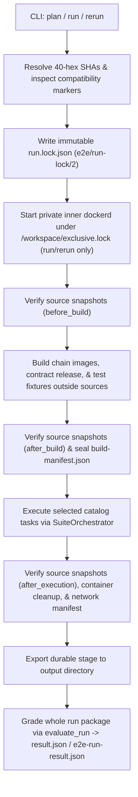

# Architecture

The `forward-e2e` runner validates an explicitly chosen pair of immutable Git
commits — one for the Gonka chain (`gonka-ai/gonka`) and one for the Forward
Marketplace contracts (`gonka24/forward-contracts`) — inside an isolated
Docker-in-Docker (`DinD`) container.

---

## 1. Two-Layer Python Architecture

The Python package `forward_e2e` is split into two layers with a strict one-way
import boundary:

```text
forward_e2e.execution.*  --->  forward_e2e.suite.*
(plan, build, execute,         (catalog, orchestrator, runtime,
 grade, export, CLI)            collector, verifier, reporter)
```

### `forward_e2e.suite` (Lower Layer)

Owns task definitions, per-task runtime lifecycle, artifact collection, task
verification, and suite reporting:

- [`catalog.py`](../forward_e2e/suite/catalog.py) — the 24-task scenario catalog,
  legacy task-ID alias resolution (`SCENARIO_ID_ALIASES`), profiles (`smoke`,
  `native`, `boundary`, `all`), per-task timeouts, and `compute_catalog_hash()`.
- [`orchestrator.py`](../forward_e2e/suite/orchestrator.py) — executes the
  selected catalog tasks in canonical catalog order, writes `suite-plan.json`,
  `e2e-context.json`, and `suite-result.json`.
- [`adapters.py`](../forward_e2e/suite/adapters.py) — builds subprocess command
  lines for `NativeTaskAdapter` (`scripts/acceptance_harness.py run-live`),
  `BoundaryTaskAdapter` (`scripts/run_go_boundary.py` and
  `scripts/test_wasm_query_boundary.mjs`), and `ContractTestTaskAdapter`
  (`cargo test`).
- [`runtime.py`](../forward_e2e/suite/runtime.py) — prepares per-task runtime
  snapshots (`identity.json`), verifies immutable source checkouts, and enforces
  post-task Docker container ownership cleanup (`cleanup-evidence/ownership.json`).
- [`collector.py`](../forward_e2e/suite/collector.py) — copies allowlisted raw
  task artifacts into the suite directory and writes `artifact-index.json`.
- [`verifier.py`](../forward_e2e/suite/verifier.py) — verifies task outputs,
  checkpoint sequences, source immutability (`check_source_immutability_document`),
  B3 genesis delta, and boundary reports.
- [`reporter.py`](../forward_e2e/suite/reporter.py) — generates offline suite
  reports (`summary.md`, `coverage.json`) and reconciles interrupted runtime
  snapshots.
- [`source_snapshot.py`](../forward_e2e/suite/source_snapshot.py) — stdlib-only
  working-tree and submodule immutability verifier (loaded by bare file path from
  `scripts/acceptance_harness.py`).
- [`supervisor.py`](../forward_e2e/suite/supervisor.py) — manages the private
  inner `dockerd` daemon under an exclusive flock (`/workspace/exclusive.lock`).

### `forward_e2e.execution` (Upper Layer)

Wraps the suite runner with cryptographic source planning, reproducible builds,
provenance verification, and whole-run grading:

- [`planner.py`](../forward_e2e/execution/planner.py) — resolves remote or local
  Git commits, inspects compatibility markers, hashes runner assets, creates
  portable Git bundles (`plan`), and writes `run.lock.json` (`e2e/run-lock/2`).
- [`builder.py`](../forward_e2e/execution/builder.py) — builds Gonka chain
  Docker images, the contract release (`vendor/contract_release/release.py`),
  and test Wasm fixtures outside the source snapshots; verifies runtime support
  images (`postgres`, `coredns`) by digest; writes `build-manifest.json`.
- [`executor.py`](../forward_e2e/execution/executor.py) — verifies runner identity
  against `run.lock.json`, checks source snapshots before build, after build, and
  after execution, invokes `SuiteOrchestrator`, checks post-run provenance, and
  exports the run package.
- [`deployment.py`](../forward_e2e/execution/deployment.py) — shared online/offline
  verifier for deployed contract hashes, runtime version observations, and
  `source-immutability.json`.
- [`outcome.py`](../forward_e2e/execution/outcome.py) — single grading function
  (`evaluate_run`) used by `run`, `rerun`, `report`, and `recover` to produce
  `e2e-run-result.json` and `result.json`.
- [`context.py`](../forward_e2e/execution/context.py) — dependency-free handover
  dataclass (`E2ERunContext`) passed from `executor.py` to `SuiteOrchestrator`.

### Import Constraints

1. `forward_e2e.suite.*` must **never** import `forward_e2e.execution.*`, with
   exactly two tolerated, pre-existing exceptions: `suite/reporter.py` and
   `suite/verifier.py` import `execution.file_safety`, whose own dependency
   closure (`execution.errors`, `execution.sources`, `execution.gitio`) never
   imports the suite, so no cycle exists.
   [`tests/unit/runner/test_import_direction.py`](../tests/unit/runner/test_import_direction.py)
   parses every suite module with `ast` and fails on any third edge, on a
   vanished documented edge, or on `file_safety` acquiring a suite import.
2. `forward_e2e/execution/context.py` imports only `dataclasses`, `pathlib`, and
   `typing` (enforced by AST unit test).
3. `forward_e2e/suite/source_snapshot.py` and `scripts/acceptance_harness.py`
   never import `forward_e2e.*` packages directly because the harness is invoked
   standalone and re-entered from Kotlin Testermint subprocesses.

---

## 2. Four Separate Filesystem Zones

The runner enforces strict physical separation between the code under test,
build outputs, runner-owned test code, and mutable chain state:

| Zone | Location | Who May Write It | How It Is Verified |
|---|---|---|---|
| **1. Sources** (Gonka and contracts checkouts) | Materialised from Git objects at the selected 40-hex SHAs, with pinned submodules | **Nobody.** Read-only after checkout. | Measured by [`forward_e2e/suite/source_snapshot.py`](../forward_e2e/suite/source_snapshot.py) before build, after build, and after every live task (`source-immutability.json`). Any modified, deleted, untracked, or ignored file fails the run (`SOURCE_SNAPSHOT_MUTATED`). |
| **2. Build outputs** (Docker build contexts, `mock-server.jar`, contract release artifacts, Cargo/Gradle caches) | `<stage>/run/build/` and `<build_out>/gradle-home`, outside both source snapshots | [`Builder`](../forward_e2e/execution/builder.py) steps only | `Builder.assert_outputs_outside_sources` rejects any build step whose output path resolves inside a source snapshot before the command runs. |
| **3. Test code** (Marketplace Kotlin scenarios and boundary probes) | Baked into the runner image under [`harness/`](../harness/) and [`scripts/`](../scripts/); compiled into `<work>/harness-build` | External Gradle build (`scripts/external_harness.py`) | Hashes of `harness/testermint`, `harness/network`, `harness/go_boundary`, and `harness/wasm_query_allowlist` are pinned in `run.lock.json` (`lock.external_tests`). Upstream `TestermintTest.kt` is copied read-only into `<buildDir>/upstream-test-src/` after a SHA-256 check; no other upstream test is compiled. |
| **4. Network state** (`GONKA_REPO_ROOT` for Testermint) | `<work>/network-root` | [`prepare_network_root`](../scripts/external_harness.py) and Testermint runtime containers | Full working tree of tracked files and submodules (excluding `.git`) is copied to `<work>/network-root`, hashed in `network/network-manifest.json`, and verified before and after execution by `verify_network_root_integrity` (with runtime-created paths such as `prod-local/**` recorded in `runtime_additions`). |

---

## 3. Execution Lifecycle



---

## 4. Boundary Mechanisms

- **Out-of-Tree Testermint Compilation:** [`scripts/external_harness.py`](../scripts/external_harness.py)
  launches Gradle through the selected Gonka checkout's own
  `testermint/gradle/wrapper/gradle-wrapper.jar` with
  `--init-script harness/testermint/gradle/out-of-tree.init.gradle.kts`,
  redirecting all build directories, project caches, and Kotlin persistent dirs
  under `<work>`.
- **Upstream API Verification:** Before starting any container, the runner checks
  `<gonka>/testermint` against [`harness/testermint/required-upstream-api.json`](../harness/testermint/required-upstream-api.json)
  and fails fast with `TESTERMINT_API_MISSING` if a required symbol is absent.
- **B3 Genesis Provisioning:** Only `foreign-native-preservation` (legacy alias
  `b3-foreign-native`) mounts [`harness/network/genesis/foreign-native-genesis-provision.sh`](../harness/network/genesis/foreign-native-genesis-provision.sh)
  via `foreign-native-genesis.yml` to add `12345ua8b3foreign` at genesis. `verify_b3_genesis_delta`
  verifies that no other account balance or supply entry changed.
- **API Container Restarts:** Restart scenarios invoke
  [`harness/container_control.py`](../harness/container_control.py), which checks
  the `io.gonka.a8.run-id` label, records the stopped container ID, and starts
  that exact container ID again.
